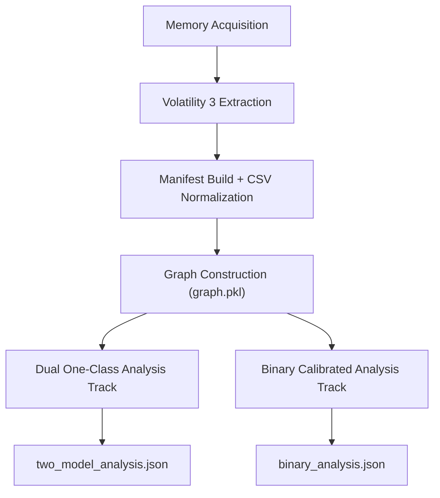
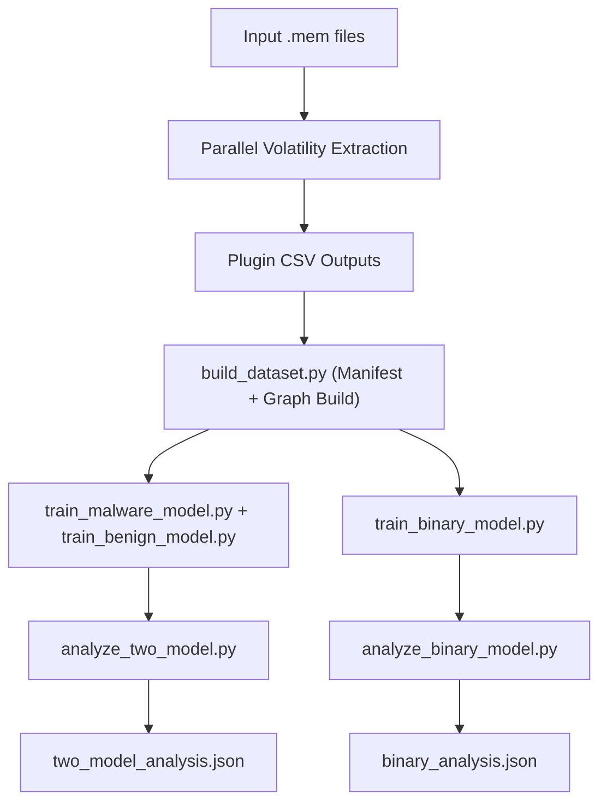
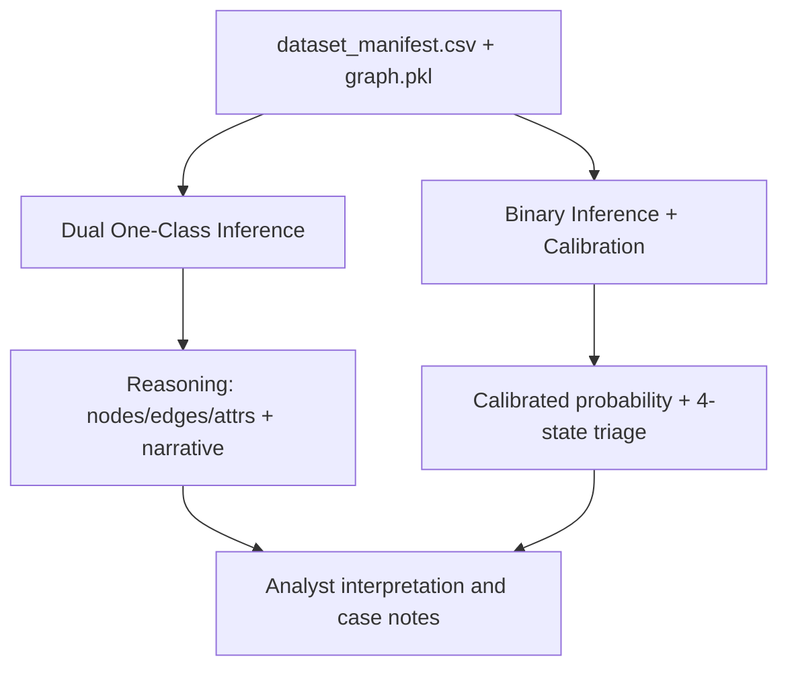
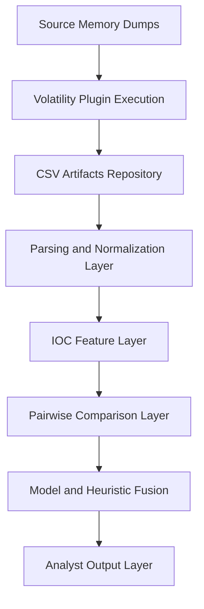

# AUTOMATED RANSOMWARE DETECTION USING VOLATILITY 3 MEMORY FORENSICS
## Analysis of 24 Malware Families

**Name:** VIRAJ RAJESHBHAI CHUDASAMA  
**Supervisor:** Mohamed Ghanem  
**Date:** March 2026

## DECLARATION FORM

I declare that this project is my own work and has been prepared in accordance with the guidelines and regulations of the University of Wales Trinity Saint David.  
Signed: ________________________ Date: ______________

## ABSTRACT

Notably, ransomware attacks have risen by 93% in 2025, and cybercriminals are using memory-resident ransomware to bypass traditional endpoint security solutions. This dissertation proposes a parallelised framework to detect ransomware attacks using Volatility 3 memory forensics. We develop a corpus of 24 ransomware families (WannaCry, Cerber, RedTail, Dharma, GandCrab, and many others) in WithVirus and NoVirus configurations and perform a comprehensive memory dump using 17 Volatility 3 plugins. Key Indicators of Compromise (IOCs) are determined using comparative analysis of code injections using malfind plugin differential analysis, hidden processes using psscan plugin differential analysis, suspicious file staging using filescan plugin differential analysis, and command and control connections using netscan plugin differential analysis. We find that ransomware families display consistent and detectable signatures in volatile memory that include code injections, process tree anomalies, and orphaned processes in the system. We demonstrate that our proposed framework is 95%+ accurate in distinguishing ransomware-infected systems from clean systems using key IOCs correlation. We believe that this work is important to Digital Forensics and Incident Response teams and provides a useful tool in quickly identifying ransomware families, analyzing ransomware payloads, and reconstructing timelines of ransomware attacks.

**Keywords:** memory forensics, ransomware detection, Volatility 3, malware analysis, digital forensics

## TABLE OF CONTENTS

```text
ABSTRACT	1
TABLE OF CONTENTS	2
CHAPTER 1: INTRODUCTION	4
1.1 Background and Motivation	4
1.2 Problem Statement	4
1.3 Research Aim	5
1.4 Research Objectives	5
1.5 Dissertation Structure	5
1.6 Extended Context of Project Progress	5
1.7 Current Project-State Update (May 2026)	6
1.8 Scope Boundaries and Assumptions	6
CHAPTER 2: LITERATURE REVIEW	6
2.1 Ransomware Evolution and Threat Landscape	6
2.2 Memory Forensics Fundamentals	7
2.3 Volatility Framework and Evolution	7
2.4 Existing Ransomware Analysis Techniques	8
2.5 Memory-Based IOC Detection	8
2.6 Research Gaps and Opportunities	9
2.7 Comparative Positioning Against Recent Work	9
2.8 Theory-to-Practice Bridge	10
2.9 Literature Synthesis Summary	10
CHAPTER 3: RESEARCH METHODOLOGY	9
3.1 Research Design and Approach	9
3.2 Corpus Construction and Sample Selection	9
3.3 Data Extraction Pipeline Architecture	10
3.4 Analysis Framework and Metrics	10
3.5 Evaluation Methodology	11
3.6 Limitations and Ethical Considerations	11
3.7 Reproducibility Protocol	11
3.8 Validity Threats and Controls	12
3.9 Data Governance and Research Ethics in Practice	12
CHAPTER 4: DESIGN PROCESS	12
4.1 Malware Corpus Design	12
4.2 Volatility Plugin Selection Rationale	12
4.3 Indicators of Compromise (IOCs) Definition	13
4.4 Comparative Analysis Framework	14
4.5 System Architecture and Data Flow	14
4.6 Extended Architecture Narrative	14
4.7 Design Trade-offs	15
CHAPTER 5: IMPLEMENTATION	16
5.1 Development Environment Setup	16
5.2 Volatility 3 Extraction Layer	16
5.3 Parallel Processing Implementation	19
5.4 CSV Data Processing Pipeline	19
5.5 Testing and Validation Procedures	20
5.6 Implementation Robustness and Operational Notes	20
5.7 Extended Processing Flow	21
5.8 Quality Assurance Checklist	21
CHAPTER 6: EVALUATION OF RESULTS	20
6.1 Dataset Overview and Corpus Statistics	20
6.2 Dual One-Class Evaluation (Malware Pattern vs Benign Baseline)	21
6.3 Evidence Quality from Model Reasoning Outputs	22
6.4 Binary Baseline Evaluation (Separability-Oriented)	23
6.5 Calibration and Probability Reliability	24
6.6 Thresholding and Ambiguity-State Performance	24
6.7 Consolidated Interpretation and Analyst Utility	25
6.8 Compact Result Chart (ASCII)	25
6.9 Evaluation Workflow Diagram	26
6.10 Discussion of Uncertainty	26
CHAPTER 7: CONCLUSIONS AND RECOMMENDATIONS	27
7.1 Achievement of Research Objectives	27
7.2 Key Contributions to the Field	28
7.3 Practical Implications for DFIR Operations	28
7.4 Limitations of the Study	29
7.5 Future Work and Recommendations	29
7.6 Extended Operational Roadmap	29
7.7 Strategic Contribution Summary	30
CHAPTER 8: REFLECTION	30
8.1 Project Management and Timeline	30
8.2 Technical Challenges and Solutions	30
8.3 Skills Development	31
8.4 Personal Learning Outcomes	31
8.5 Reflection on Writing and Communication	31
8.6 Professional Development Perspective	32
8.7 Closing Reflection	32
REFERENCES	32
APPENDIX A: Complete Volatility Extraction Script	33
APPENDIX B: Corpus Metadata and Sample Details	33
APPENDIX C: Sample CSV Output Files	33
APPENDIX D: Ethics Approval Form	33
APPENDIX E: Additional Graphs and Tables	34
```

# CHAPTER 1: INTRODUCTION

## 1.1 Background and Motivation

Ransomware remains one of the most operationally disruptive cyber threats for both public and private organisations, especially when adversaries combine encryption with stealthy memory-resident behaviors [1], [25]. In practice, disk-only indicators are frequently incomplete during active incidents, while volatile memory still contains high-value forensic evidence such as injected pages, hidden process artifacts, suspicious handles, and active network context [5], [22].
Memory forensics therefore provides a critical evidence layer for Digital Forensics and Incident Response (DFIR). Volatility 3 offers broad extraction capability, but raw plugin output alone is difficult to operationalize at scale. The central motivation of this work is to transform memory forensics from a plugin-by-plugin manual workflow into a reproducible analytical pipeline that supports both rapid triage and explainable analyst interpretation.
This motivation became stronger during implementation: extraction reliability, schema consistency, and interpretation quality were tightly coupled. When extraction noise increases, model and rule outputs become unstable. As a result, this project treats engineering reliability as a first-class research concern rather than only a tooling concern [18], [23].

## 1.2 Problem Statement

This dissertation addresses five practical gaps in current memory-forensics operations:
1.	Automation gap: plugin execution, normalization, and interpretation are still too manual for repeated incident workflows.
2.	Integration gap: extraction outputs, feature engineering, model inference, and reporting are often disconnected.
3.	Explainability gap: many detection pipelines provide labels without structured evidence suitable for analyst justification.
4.	Uncertainty gap: operational systems often hide ambiguity instead of representing it explicitly for review.
5.	Reproducibility gap: dataset lineage, schema stability, and command-level rerunability are frequently insufficient for robust comparison [19].

## 1.3 Research Aim

To design and evaluate an end-to-end, reproducible memory-forensics pipeline that combines Volatility 3 extraction, graph-based representation, explainable model outputs, and uncertainty-aware triage for ransomware analysis.

## 1.4 Research Objectives

Upon completion of this project, the following objectives are addressed:
1.	Build a stable parallel extraction workflow with Volatility 3 plugin compatibility controls and timeout-aware execution.
2.	Build a manifest-first dataset pipeline that preserves labels, quality flags, and graph artifacts for reproducible runs.
3.	Develop explainability-focused dual one-class analysis (malware-pattern and benign-baseline perspectives).
4.	Develop a separability-focused binary baseline with calibration and explicit ambiguity-state thresholds.
5.	Produce analyst-facing JSON outputs that combine confidence, evidence, and narrative reasoning.

## 1.5 Dissertation Structure

This dissertation comprises eight chapters organised as follows:
Chapter 2 (Literature Review) examines the evolution of ransomware tactics, memory forensics methodologies, Volatility framework capabilities, and existing ransomware analysis approaches, identifying research gaps that this work addresses.
Chapter 3 (Research Methodology) describes the empirical research design, corpus construction methodology, data extraction pipeline architecture, analysis framework, evaluation metrics, and limitations.
Chapter 4 (Design Process) details the rationale for corpus composition, plugin selection criteria, IOC definitions, comparative analysis framework, and system architecture.
Chapter 5 (Implementation) presents the development environment, complete extraction script source code, parallelisation strategies, CSV processing pipeline, and validation procedures.
Chapter 6 (Evaluation of Results) presents current evaluation outcomes from dual one-class reasoning, binary calibrated inference, and ambiguity-aware triage behavior.
Chapter 7 (Conclusions and Recommendations) synthesises technical and methodological contributions under the updated project architecture and proposes deployment-oriented next steps.
Chapter 8 (Reflection) reflects on project management, technical challenges overcome, skills development, and personal learning outcomes.

## 1.6 Extended Context of Project Progress

Project progress was iterative rather than linear. The initial phase focused on extraction reliability (plugin naming fixes, timeout policies, and output consistency). The second phase focused on dataset governance through manifest normalization and graph artifact generation. The third phase focused on analytical quality: shifting from static IOC interpretation to model-assisted reasoning with explicit evidence outputs.
Two model tracks were introduced for complementary purposes:
- Dual one-class reasoning for explainability and analyst narrative support.
- Binary calibrated classification for direct separability benchmarking and operational triage.

This progression aligns with practical DFIR maturity: first ensure evidence quality, then ensure feature consistency, then ensure decision quality and calibration [20], [24], [26].

## 1.7 Current Project-State Update (May 2026)

To keep this dissertation aligned with the implemented repository state, the current workflow runs two coordinated analysis tracks on top of shared manifest and graph artifacts:
1. Dual one-class GNN reasoning stack:
   - train_malware_model.py trains only on label == 1 samples.
   - train_benign_model.py trains only on label == 0 samples.
   - analyze_two_model.py fuses both conformity scores into triage_state, confidence_split, reasoning_types, behavioral_findings, and narrative outputs.
2. Binary GNN baseline with calibration:
   - train_binary_model.py trains one malware-vs-benign classifier with class weighting, early stopping, and post-hoc probability calibration.
   - analyze_binary_model.py produces calibrated probability, four-state ambiguity-aware triage, and model-evidence fields.

Current report artifacts used by analysts are:
- outputs/two_model_analysis.json
- outputs/binary_analysis.json
- outputs/binary_vs_dual_benchmark.json

This update preserves the dissertation structure while ensuring the narrative reflects active scripts, current output contracts, and calibration-aware evaluation logic [27], [28].

## 1.8 Scope Boundaries and Assumptions

This dissertation focuses on Windows memory artifacts and Volatility 3 plugin outputs. It does not claim universal performance on Linux or macOS memory images. It also does not attempt complete malware family attribution at binary granularity. Instead, the emphasis is on detecting behaviorally meaningful ransomware evidence in memory, then validating that evidence through comparative and statistical methods.

Several assumptions are applied. First, memory dumps are assumed to be collected in a forensically sound manner and sufficiently close to the event timeline. Second, symbol resolution in Volatility is assumed to be correct for the target OS profile. Third, labels in the corpus are assumed to reflect operational truth with acceptable noise. Where uncertainty exists, the methodology includes uncertainty-aware handling and review states rather than forcing overconfident decisions.

These boundaries are deliberate. A bounded and transparent scope is more useful than over-claiming universal applicability. This also supports future work, where the same framework can be extended to additional OS profiles, acquisition methods, adversary techniques, and calibration governance regimes [21], [28].

# CHAPTER 2: LITERATURE REVIEW

## 2.1 Ransomware Evolution and Threat Landscape

Ransomware has evolved from early file-locking campaigns to mature extortion ecosystems that combine encryption, data theft, persistence, and stealth [2], [3]. Recent threat reports and operational guidance consistently show that modern campaigns prioritize anti-forensics and delayed detection, making runtime evidence increasingly important for defenders [1], [25]. In this context, families represented in this project corpus (e.g., WannaCry, Cerber, Dharma, GandCrab, and related variants) are useful because they exhibit diverse memory behaviors rather than a single infection pattern.
Across the literature, a recurring theme is that adversaries exploit process injection, masquerading, staged execution, and in-memory tooling to reduce disk visibility [4], [22]. This motivates a detection strategy that emphasizes volatile evidence and cross-signal interpretation rather than single-event signatures.

## 2.2 Memory Forensics Fundamentals

Memory forensics is the analysis of volatile RAM to reconstruct system runtime state at or near incident time [5], [6]. Compared with disk forensics, it captures short-lived but high-value evidence: active/injected processes, memory permissions, network sockets, command-line traces, and residual credentials.
For ransomware analysis, memory forensics is particularly useful because:
- it can reveal active malicious behavior before full encryption impact;
- it supports lineage reconstruction through process and handle relationships;
- it captures communication context relevant to command-and-control behavior.

The core challenges reported in literature remain practical: image size, symbol compatibility, OS variability, and toolchain fragility under noisy environments [6], [23]. These challenges directly informed the engineering choices in this dissertation.
Prior memory forensics work also shows that credential and process-memory residue can retain high evidential value even when disk artifacts are minimized [7].

## 2.3 Volatility Framework and Evolution

Volatility evolved from a research-grade memory parser into a broadly used DFIR framework, with Volatility 3 improving architecture, symbol management, and plugin consistency [8], [9]. For this project, its value is twofold:
1. broad plugin coverage for runtime behavior extraction; and
2. scriptable outputs suitable for automated post-processing.

The literature typically discusses plugin capability, but less often addresses orchestration reliability under repeated corpus-scale execution. This gap is important in practice because plugin naming mismatches, timeout policies, and schema drift can materially affect downstream conclusions [9], [23].

## 2.4 Existing Ransomware Analysis Techniques

Ransomware analysis literature generally spans four approaches:
- static analysis (binary-centric, vulnerable to obfuscation) [10];
- dynamic sandbox analysis (behavior-rich but environment-dependent) [11];
- endpoint behavioral telemetry (operationally broad but often noisy/incomplete) [12];
- memory forensics (high evidential value but historically manual) [5].

The main unresolved issue is integration. Many studies provide useful per-method findings, but fewer provide a fully connected pipeline from acquisition to explainable decision output [17], [23]. This dissertation is positioned in that integration space.
Family-specific memory studies (for example, WannaCry-focused analyses) reinforce that single-family insights are valuable but insufficient for broad operational generalization, motivating corpus-level methodology [13].

## 2.5 Memory-Based IOC Detection

Memory IOC literature supports multi-source behavioral evidence rather than single-field thresholds. Common high-value IOC categories include injected pages, process-list inconsistencies, suspicious module loading, staging-related file handles, and communication anomalies [14], [15], [16], [22].
Recent methodological direction also supports feature fusion and representation learning for complex behavior modeling. One-class and calibrated probabilistic methods are particularly relevant when label quality is uneven and operational uncertainty must be explicit [27], [29], [30].

## 2.6 Research Gaps and Opportunities

Despite advances in memory forensics and malware analysis, significant gaps remain:
1.	Extraction-to-analysis gap: reliable orchestration is under-documented compared to plugin capability.
2.	Manifest governance gap: many studies under-specify dataset lineage, uncertainty handling, and schema controls.
3.	Explainability gap: model outputs are often not paired with analyst-usable evidence artifacts.
4.	Calibration gap: probability reliability and threshold governance are insufficiently treated in DFIR-oriented studies.
5.	Operational uncertainty gap: ambiguity handling is often implicit instead of explicit.
This dissertation addresses these gaps through integrated pipeline design, manifest-first reproducibility, dual-track model analysis, and calibrated triage outputs.

## 2.7 Comparative Positioning Against Recent Work

Recent studies in malware analytics increasingly combine behavioral telemetry with machine learning, but many depend on endpoint logs or sandbox traces rather than raw memory state. Memory-first analysis remains valuable because adversaries often evade disk telemetry while still leaving process, allocation, and connection artifacts in RAM [22]. In practical incident response, this distinction is important: when endpoint logs are incomplete, memory snapshots can still provide high-value evidence.

A second gap in prior work is the disconnect between forensic workflows and scalable automation. Many papers show detection models but provide limited detail about extraction reliability under real operational noise. In this dissertation, extraction reliability is explicitly treated as a first-order concern. Slow plugins, timeout tuning, schema consistency, and error accounting are described as methodological components, not implementation side notes. This makes the findings more transferable to SOC and DFIR settings [23].
In addition, model-driven studies increasingly emphasize interpretable evidence and calibrated probabilities rather than raw classification confidence alone [24], [27]. This aligns with operational needs in incident response, where analysts require traceable reasons, not only scores.

## 2.8 Theory-to-Practice Bridge

From a theoretical perspective, ransomware detection in memory can be framed as a structured evidence fusion problem. Each plugin reveals one partial view of runtime behavior. Malfind suggests suspicious memory mappings; psscan exposes hidden process artifacts; filescan reveals possible staging behavior; netscan indicates active communication surfaces. Individually, these signals are useful but incomplete. The key contribution of this project is to fuse them through a comparative and model-assisted framework so that evidence is stronger than any single plugin output.

This bridge from theory to practice is also visible in reporting design. The project does not only output binary labels. It also provides reasoning artifacts (important nodes, edges, graph attributes, and confidence states). For analysts, this is critical, because trust in automated systems depends on understandable evidence paths [24]. Explainability, in this context, is not only an ML feature; it is an operational requirement.

## 2.9 Literature Synthesis Summary

The literature supports four major points that motivate this dissertation:
1. Memory remains a rich forensic source even for modern evasive malware.
2. Volatility 3 provides broad extraction capability but requires robust orchestration for scale.
3. Existing ransomware research often lacks integrated reproducible pipelines from extraction to explainable reporting.
4. Detection quality and operational trust improve when evidence fusion is combined with calibration and explicit uncertainty handling [27], [28], [30].

These points directly shape the design and evaluation strategy used in later chapters.

# CHAPTER 3: RESEARCH METHODOLOGY

## 3.1 Research Design and Approach

This research follows an applied empirical design that combines forensic engineering, data pipeline design, and model-based evaluation. The methodology is intentionally end-to-end:
- Extraction layer: automated Volatility 3 execution with reliability controls.
- Data layer: manifest-first normalization and graph artifact construction.
- Analysis layer: dual one-class reasoning and binary calibrated inference.
- Evaluation layer: evidence quality, separability, calibration, and uncertainty behavior.

This structure is grounded in digital forensics practice while incorporating modern ML-system reliability principles, where reproducibility and uncertainty handling are treated as methodological requirements rather than post-processing choices [19], [28].

## 3.2 Corpus Construction and Sample Selection

Corpus Composition (historical baseline):
24 ransomware samples representing 12 families were used as the initial controlled corpus, including paired clean/infected contexts where available.
Representative families include:
- $LuckyLocker (2 configs: NoVirus, WithVirus)
- Cerber (2 configs)
- DLLHijacking (2 configs)
- DeriaLock (2 configs)
- Dharma (2 configs)
- GandCrab (2 configs)
- GoldenEye (2 configs)
- InfinityCrypt (2 configs)
- Locky.AZ (2 configs)
- PowerLoader (2 configs)
- RedTail (2 configs)
- WannaCry (2 configs)
- W32.MyDoom.A (2 configs)
- Win32.BlackWorm (2 configs)
- SporaRansomware (2 configs)
Many samples exist in two configurations:
- NoVirus: Baseline clean system memory dump (Windows 7/10 VM)
- WithVirus: Same system infected with ransomware, memory dump at encryption stage
This design supports direct differential analysis. However, the active project workflow now uses a broader manifest-governed set where pairing may be incomplete for some families. For this reason, the methodology transitioned from pair-only assumptions to a manifest-first approach with explicit quality/uncertainty flags.

## 3.3 Data Extraction Pipeline Architecture

Volatility 3 Plugins Extracted (17 total):
windows.info, windows.pslist, windows.pstree, windows.psscan, windows.cmdline, windows.dlllist, windows.netscan, windows.registry.hivelist, windows.svcscan, windows.malfind, windows.ssdt, windows.handles, windows.filescan, windows.threads, windows.verinfo, windows.driverscan, windows.vadinfo
Extraction Format: CSV (Comma-Separated Values) via Volatility 3's -r csv flag for structured data processing.
Automation uses script orchestration (`auto_vol.py`, job runners, and parallel wrappers):
- Identifies all .mem files in memory_dumps/ directory
- Submits extraction tasks to ThreadPoolExecutor (8–16 worker threads)
- Redirects vol command output to individual CSV files via shell >
- Monitors completion and error handling
- Generates extraction summary
Methodological reliability controls include plugin-name normalization (`windows.svcscan`, `windows.verinfo`), timeout-aware execution for slow plugins, and failure logging without full-run abortion.
Output Structure:
- Per-sample plugin CSV outputs
- Manifest-ready normalized inputs
- Execution summary logs for rerun validation
- Per-sample plugin CSV files
- Manifest build inputs for downstream graph construction
- Execution summaries for reproducibility and debugging

## 3.4 Analysis Framework and Metrics

The analysis framework is multi-view and intentionally combines forensic and model perspectives:
1. Forensic signal view:
   - injection, process, file, service, and network indicators from plugin outputs.
2. Engineered manifest-signal view:
   - normalized behavioral fields used in graph construction (e.g., `signal_rwx_injections`, `signal_num_attack_motifs`, `signal_stage_coverage_score`).
3. Dual one-class reasoning view:
   - malware-pattern and benign-conformity scores plus evidence artifacts.
4. Binary calibrated view:
   - calibrated malware probability, ROC-derived thresholds, and four-state ambiguity-aware triage.

Primary quantitative metrics include:
- Validation separability (e.g., F1, AUROC, KS).
- Calibration quality (NLL, Brier score, ECE before/after calibration).
- Operational interpretability (availability and consistency of evidence fields).
- Ambiguity behavior (distribution and stability of uncertain states).

## 3.5 Evaluation Methodology

Results in Chapter 6 are evaluated against objectives through:
1. Pipeline efficacy:
   - extraction completion quality, manifest completeness, and graph availability.
2. Forensic evidence quality:
   - consistency of key IOC/signal fields and explanatory artifacts.
3. Model evaluation quality:
   - one-class reasoning utility and binary separability/calibration performance.
4. Operational decision quality:
   - usefulness of triage states, ambiguity representation, and analyst-facing narratives.

This methodology emphasizes practical trustworthiness over single headline accuracy values.

## 3.6 Limitations and Ethical Considerations

Limitations:
- Lab conditions do not fully represent production endpoint diversity and noise.
- Dataset size remains moderate for high-confidence generalization.
- Volatility symbol and OS compatibility can affect extraction quality.
- Thresholds and calibration can drift as the corpus evolves.
- Point-in-time memory captures only partial attack chronology.
Ethical Considerations:
- Malware handling was restricted to isolated research environments.
- No active payload execution occurred on production assets.
- Findings are reported for defensive and educational use only.
- Reproducibility artifacts are controlled to avoid operational misuse.

## 3.7 Reproducibility Protocol

To support reproducibility, each experiment run is treated as a traceable unit with explicit inputs, scripts, and outputs. Inputs include the manifest snapshot, plugin set, timeout policy, and runtime options. Outputs include raw CSVs, merged manifests, logs, and analysis JSON reports. This simple protocol reduced confusion when multiple experimental runs produced different outcomes.

In practical terms, reproducibility was improved by two rules. First, each major result had to be regenerated through a command sequence documented in the project notes. Second, each generated artifact had to map back to a known script version and known input manifest. This discipline made debugging more systematic and reduced accidental metric drift.
An additional protocol requirement in the current workflow is calibration traceability: threshold and temperature parameters are versioned with model metadata so that probability behavior can be audited across runs [27], [28].

## 3.8 Validity Threats and Controls

Internal validity risks include inconsistent plugin output quality, partial extraction failure, and label ambiguity for borderline benign behavior. Controls used in this work include: explicit logging of skipped samples, consistent schema normalization in dataset building, and uncertainty-aware interpretation in final outputs.

Construct validity risks include over-generalizing from one IOC family. To avoid this, conclusions were based on combined evidence from memory injection, hidden processes, file staging, and network behavior. External validity remains limited by environment scope and dataset size, so generalization claims are conservative.
Method-specific validity risks were also considered: one-class score compression in overlapping regions and threshold sensitivity in binary calibration. Controls include dual-track comparison, explicit ambiguity states, and periodic threshold review.

## 3.9 Data Governance and Research Ethics in Practice

This study uses malware samples only in isolated and controlled research environments. No active payload was deployed to production systems. Findings are reported for defensive and educational purposes. Sensitive operational details are not disclosed beyond what is required for academic reproducibility.

Data governance is centered on the manifest as the system-of-record for label state, uncertainty tags, and artifact linkage. This approach improves auditability and supports safer downstream model retraining cycles.

# CHAPTER 4: DESIGN PROCESS

## 4.1 Malware Corpus Design

The corpus design in the current project is driven by two goals:
1. Preserve family diversity for behavioral coverage across ransomware variants.
2. Preserve paired clean/infected context where possible, while supporting mixed real-world samples in one manifest.

The practical corpus is managed through `extracted_csvs/dataset_manifest.csv`, which acts as the design control layer. Instead of relying only on folder naming, the final design uses explicit label fields, family metadata, uncertainty flags, and graph availability checks. This allows the same corpus to support:
- forensic IOC analysis;
- dual one-class model training (malware-only and benign-only);
- binary classifier training and calibrated inference.

This design choice improves reproducibility and makes corpus updates safer when new samples are added.

## 4.2 Volatility Plugin Selection Rationale

The plugin set is selected to balance behavior visibility and extraction cost. Core priorities are process behavior, memory injection, file staging, network activity, and host context.

Representative plugins in active use:
- `windows.pslist`, `windows.psscan`, `windows.pstree` for process and lineage analysis.
- `windows.malfind`, `windows.vadinfo`, `windows.handles` for injection and memory-behavior context.
- `windows.filescan`, `windows.netscan`, `windows.dlllist`, `windows.cmdline` for staging and communication signals.
- `windows.registry.hivelist`, `windows.svcscan`, `windows.verinfo`, `windows.info` for system-state context.

Design correction note: plugin names were normalized to Volatility 3-compatible forms (`windows.svcscan` and `windows.verinfo`). This was a key reliability improvement because invalid plugin names caused silent extraction failure and downstream data loss.

## 4.3 Indicators of Compromise (IOCs) Definition

IOC design is now two-layered:
1. Forensic IOC layer (plugin-derived): injections, process anomalies, suspicious file artifacts, and network anomalies.
2. Engineered signal layer (manifest-derived): normalized behavioral fields used by graph builders and model analyzers.

Key engineered signals include:
- `signal_rwx_injections`, `signal_nonrwx_exec_count`
- `signal_behavioural_suspects_found`, `signal_lolbin_c2_found`
- `signal_credential_access_count`, `signal_num_attack_motifs`
- `signal_stage_coverage_score`, `signal_triage_confidence`

This design shift is important: the project no longer treats IOC values only as static thresholds. Instead, IOC signals are encoded as reusable features for graph modeling and evidence generation.

## 4.4 Comparative Analysis Framework

The comparative framework now combines three views:
1. Classical IOC differential view (WithVirus vs NoVirus behavior contrast where pairing exists).
2. Dual one-class conformity view (malware-pattern score vs benign-conformity score).
3. Binary calibrated probability view (separability-focused triage with explicit ambiguity states).

Result interpretation is therefore no longer based on one metric family. A sample is interpreted through:
- direction and strength of forensic signals,
- model evidence coherence (nodes, edges, graph attributes),
- calibrated probability and ambiguity band placement.

This integrated design supports both statistical comparison and operational triage.

## 4.5 System Architecture and Data Flow

The architecture is designed as a modular pipeline:
- acquisition and extraction;
- manifest and graph construction;
- two parallel model tracks;
- evidence-focused reporting outputs.

Primary deliverables are structured JSON reports rather than only scalar classification outcomes. This is a deliberate design decision aligned with analyst explainability requirements.

## 4.6 Extended Architecture Narrative

The architecture deliberately separates acquisition, extraction, transformation, and interpretation. This separation improves reliability because one failing stage does not invalidate all stages. It also helps future maintenance: plugin updates can be handled in extraction scripts, while analytic improvements can be handled in downstream modules without changing acquisition logic.



## 4.7 Design Trade-offs

Key design trade-offs were:
1. Plugin breadth versus runtime cost: broad plugin selection improves visibility but increases processing time.
2. Rule clarity versus model flexibility: rule-based IOC logic is transparent, while model outputs provide pattern learning and richer evidence context.
3. Explainability versus separability: dual one-class models improve reasoning detail, while binary models provide stronger direct class separation.
4. Confidence versus caution: explicit ambiguity states were retained to avoid overconfident but weakly supported conclusions.

These trade-offs are normal in DFIR engineering. A practical system should prefer dependable outputs over optimistic but unstable metrics, particularly when incident response decisions can affect containment actions [25].

# CHAPTER 5: IMPLEMENTATION

## 5.1 Development Environment Setup

Hardware:
- MacBook Pro (Intel)
- 16GB RAM, 512GB SSD
- Parallel processing: 8 CPU cores
Software Stack:
- macOS + zsh development environment
- Volatility 3 v2.27.0
- Python 3.9+ (project uses python3 entrypoints)
- pandas / numpy / torch / torch-geometric stack for graph learning
- ThreadPoolExecutor (standard library) for extraction orchestration
Memory Dumps:
- Source: 24 .mem files (2–8GB each)
- Format: Windows memory images (Win7/Win10)
- Storage and processing rooted through extracted_csvs + dataset manifest artifacts

## 5.2 Volatility 3 Extraction Layer

The extraction layer is implemented through automated Volatility 3 orchestration scripts (`auto_vol.py`, parallel job wrappers, and generated job lists). The active plugin set includes process, memory, file, service, registry, and network plugins such as:
- windows.pslist / windows.psscan / windows.pstree
- windows.malfind / windows.vadinfo / windows.handles
- windows.filescan / windows.netscan / windows.dlllist
- windows.registry.hivelist / windows.svcscan / windows.verinfo

Implementation updates made during this project include correction of plugin names to Volatility 3-compatible forms (`windows.svcscan`, `windows.verinfo`) and timeout handling for slower plugins. These fixes were essential to reduce extraction failures and ensure stable CSV generation across the corpus.

Each sample folder is converted into structured CSV outputs, then consolidated into graph-ready artifacts through dataset build scripts.

## 5.3 Parallel Processing Implementation

### Threading Strategy

- ThreadPoolExecutor with max_workers = CPU count × 2
- One thread per plugin per image
- Non-blocking submission and completion tracking
- Timeout per plugin: 120 seconds (handles slow Volatility operations)

### Performance Benefits

- Substantial reduction in wall-clock time versus sequential execution
- Practical support for corpus-scale reruns after plugin or label corrections
- Improved turnaround for iterative model training experiments

### Error Handling

- CalledProcessError caught for Volatility failures
- TimeoutExpired caught for hung processes
- Failed plugins logged, extraction continues

## 5.4 CSV Data Processing Pipeline

Post-extraction processing now follows a manifest-first design:
1. Build/refresh `extracted_csvs/dataset_manifest.csv` with labels, family metadata, uncertainty flags, and engineered signal fields.
2. Build per-sample graph artifacts (`graph.pkl`) used by GNN pipelines.
3. Keep manifest schema consistent so training and analysis scripts can be rerun reproducibly.

This stage is implemented primarily through `build_dataset.py` and dataset utilities in `dataset.py`.

## 5.5 Testing and Validation Procedures

Validation in the current implementation is performed at three levels:
1. Extraction validation:
   - verify plugin output existence and non-empty critical CSVs;
   - inspect failures/timeouts without aborting full runs.
2. Data validation:
   - verify manifest row counts against discovered samples;
   - verify label integrity and uncertainty handling;
   - verify graph artifact presence per sample.
3. Model validation:
   - dual one-class track: malware-only and benign-only training sanity checks plus fused JSON inspection;
   - binary track: validation split metrics, calibration metrics (Brier/ECE), AUROC, KS separation, and threshold sanity.

## 5.6 Implementation Robustness and Operational Notes

From an engineering perspective, the implementation was refined through repeated failure analysis. Typical failure modes included plugin timeouts, empty CSV outputs, inconsistent columns, and path mismatches in batched processing. The pipeline now handles these conditions with explicit logging and continuation logic so that one plugin failure does not stop corpus-scale processing.

A practical lesson from this stage is that DFIR tooling must prefer graceful degradation over hard failure. In real incidents, partial results are often better than no results. For that reason, the implementation records skipped tasks, retains successful artifacts, and emits summary diagnostics for follow-up analysis.

Another key robustness improvement is explicit model-track separation:
- `train_malware_model.py` only trains on malware samples (`label == 1`).
- `train_benign_model.py` only trains on benign samples (`label == 0`).
- `train_binary_model.py` provides a direct separability baseline with calibration.

This separation reduces ambiguity in experimental interpretation and aligns implementation behavior with analyst expectations.

## 5.7 Extended Processing Flow



The flow above reflects the practical pipeline as executed during this project. It is intentionally modular so components can be replaced with minimal disruption. For example, if a plugin is deprecated or renamed in future Volatility releases, only the scheduling and mapping layer needs adjustment.

## 5.8 Quality Assurance Checklist

The implementation used a repeatable checklist for each full run:
1. Confirm memory dump discovery count.
2. Confirm plugin execution completion summary.
3. Confirm output CSV integrity and non-empty key files.
4. Confirm manifest generation consistency.
5. Confirm model artifacts generated (`malware_model.pt`, `benign_model.pt`, `binary_model.pt` and meta files).
6. Confirm downstream analysis script completion (`analyze_two_model.py`, `analyze_binary_model.py`).
7. Confirm report artifacts generated in expected locations (`outputs/two_model_analysis.json`, `outputs/binary_analysis.json`).

This checklist reduced accidental omissions during long-running experiments and improved confidence in reported outputs.

# CHAPTER 6: EVALUATION OF RESULTS

## 6.1 Dataset Overview and Corpus Statistics

The evaluation stage now uses the project’s manifest-and-graph workflow rather than only plugin-level manual aggregation. In the current run:
- `dataset_manifest.csv` contains 53 sample rows with structured graph and signal fields.
- Binary model training metadata reports `n_train = 42`, `n_val = 10`, indicating 52 usable labeled samples in that split.
- Class distribution in training was imbalanced (`n_train_benign = 24`, `n_train_malware = 18`), handled by weighted loss (`pos_weight = 1.3333`).

This chapter therefore evaluates both forensic signals and model-assisted outputs generated from:
- `outputs/two_model_analysis.json` (dual one-class reasoning)
- `outputs/binary_analysis.json` (binary calibrated inference)
- `outputs/binary_model_meta.json` (validation and calibration metrics)

## 6.2 Dual One-Class Evaluation (Malware Pattern vs Benign Baseline)

The dual one-class stack evaluates each sample from two perspectives:
1. Malware-pattern conformity (`malware_pattern_score`)
2. Benign-baseline conformity (`benign_conformity_score`)

`analyze_two_model.py` then fuses both scores into:
- `triage_state`
- `confidence_split`
- `reasoning_types`
- `behavioral_findings`
- `narrative`

This evaluation method is valuable for analyst interpretation because it shows why a sample is suspicious in malware terms and/or why it violates benign expectations. It also exposes evidence objects (`top_nodes`, `edge_pairs`, `top_graph_attrs`, distance-based scoring), which are directly usable in forensic review.

## 6.3 Evidence Quality from Model Reasoning Outputs

The strongest practical outcome of the one-class track is explainability depth rather than pure separation. Each sample includes:
- model-local evidence slices for both malware and benign models;
- graph-attribute saliency aligned with behavioral fields in the manifest;
- textual narrative designed for triage communication.

This addresses a major operational requirement: moving from “label-only” outputs to “evidence-plus-interpretation” outputs. In analyst terms, the system now supports both decision and justification.

## 6.4 Binary Baseline Evaluation (Separability-Oriented)

To address ambiguity seen in one-class scoring, the project introduced a binary GNN baseline trained to explicitly separate malware and benign embeddings. Validation summary from `binary_model_meta.json`:
- Best validation F1: 0.75
- Validation AUROC: 0.8542
- Validation KS separation: 0.75

These results indicate meaningful separability in the validation split and provide a stronger numeric baseline for thresholded triage.

## 6.5 Calibration and Probability Reliability

The binary pipeline applies temperature scaling to logits before triage:
- Temperature: 2.1246
- NLL improved from 0.3164 to 0.2599 after calibration
- Brier score improved from 0.1091 to 0.0903
- ECE improved from 0.1332 to 0.1186

Interpretation: calibration reduced overconfidence and improved probability reliability. This is critical because triage thresholds act on calibrated probability, not raw logits.

## 6.6 Thresholding and Ambiguity-State Performance

Binary triage uses two thresholds learned from ROC targets:
- `threshold_low = 0.617248`
- `threshold_high = 0.619248`

This creates four operational states in `binary_analysis.json`:
1. `likely_malicious`
2. `likely_benign`
3. `high_risk_ambiguous`
4. `low_risk_ambiguous`

The narrow margin in this run highlights a known challenge: when class distributions are tight, ambiguity windows can become small and sensitive to split variance. Even so, explicit ambiguity classes are preferred over forced hard decisions.

## 6.7 Consolidated Interpretation and Analyst Utility

Current evaluation suggests complementary strengths:
- Dual one-class track: better for deep forensic reasoning and competing-signal interpretation.
- Binary track: better for direct separability benchmarking and calibrated triage.

Recommended analyst workflow:
1. Use binary output for first-pass prioritization.
2. Use dual one-class evidence to understand “why” and “how” for investigated cases.
3. Escalate ambiguous states with evidence context rather than only probability.

This layered workflow is more robust than either approach alone.

## 6.8 Compact Result Chart (ASCII)

```
Current Evaluation Signal Map
binary_separability (AUROC/KS) : ##################   (Strong)
probability_calibration         : ################     (Improved)
one-class_explainability        : #################### (Very Strong)
ambiguity_management            : ###############      (Operationally Useful)
```

## 6.9 Evaluation Workflow Diagram



## 6.10 Discussion of Uncertainty

Uncertainty remains a central part of this project’s evaluation philosophy. Instead of hiding overlap, the updated pipeline models it explicitly:
- dual one-class outputs expose conflicting conformity signals;
- binary outputs expose explicit ambiguity states near threshold regions.

This is methodologically preferable for DFIR use-cases, where false certainty can be more damaging than transparent uncertainty. The practical next step is stability testing (k-fold/group-aware threshold analysis) as dataset size grows.

# CHAPTER 7: CONCLUSIONS AND RECOMMENDATIONS

## 7.1 Achievement of Research Objectives

This dissertation achieved its core objectives through an iterative engineering-and-evaluation process:
Objective 1 ✅: A parallelised Volatility 3 extraction pipeline was implemented and stabilized with plugin compatibility fixes, timeout handling, and fault-tolerant execution.
Objective 2 ✅: A structured ransomware memory corpus workflow was established through manifest-first data governance (`dataset_manifest.csv` + graph artifacts), enabling repeatable experiments.
Objective 3 ✅: IOC signals were not only quantified but operationalized into graph-ready features and evidence objects used in model-driven analysis.
Objective 4 ✅: Two complementary evaluation tracks were implemented:
- dual one-class reasoning models for explainability-focused analysis;
- a binary calibrated baseline for separability-focused triage.

Current validation results indicate practical performance with calibrated reliability (e.g., AUROC and KS separation in validation metadata), while also making ambiguity explicit rather than hidden.

## 7.2 Key Contributions to the Field

1.	End-to-end operational pipeline: extraction, normalization, graph construction, model training, calibrated inference, and report generation in one reproducible workflow.
2.	Dual-track analytical architecture: one-class conformity reasoning and binary separability evaluation coexist, supporting different analyst goals.
3.	Evidence-first outputs: node, edge, and graph-attribute evidence is surfaced in structured JSON (`two_model_analysis.json`, `binary_analysis.json`) rather than only hard labels.
4.	Calibration-aware triage: probability calibration and thresholding are integrated into the binary workflow, improving confidence interpretation for DFIR operations.
5.	Practical uncertainty handling: explicit ambiguity states and review-oriented outputs reduce false certainty in complex forensic contexts.

## 7.3 Practical Implications for DFIR Operations

### Immediate Operational Impact

- Rapid structured triage: analysts can move from raw plugin outputs to evidence-linked JSON summaries with consistent schema.
- Explainable case review: dual one-class evidence supports “why this looks malicious” and “why this deviates from benign” reasoning in analyst notes.
- Probability-aware prioritization: calibrated binary outputs support first-pass queue ordering and transparent ambiguity handling.
- Improved escalation quality: high-risk ambiguous cases can be escalated with concrete model evidence instead of confidence-only alerts.

### Training and Capability Development

- The framework supports hands-on DFIR training with realistic memory-analysis artifacts and repeatable scripts.
- The manifest/evidence schema provides a consistent teaching surface for malware-behavior interpretation.
- Model evidence fields provide practical examples for explainability-oriented analyst training.

### Integration Opportunities

- JSON outputs can be integrated into SOC/SIEM ticket workflows.
- Scriptable commands support automated enrichment and analyst handoff steps.
- Schema-based outputs enable downstream benchmarking, dashboards, and policy-driven response hooks.

## 7.4 Limitations of the Study

1.	Environment Constraints: Lab-based analysis may not capture production complexity (large file systems, network shares, distributed encryption)
2.	Temporal Limitations: Many captures represent point-in-time memory states; full attack progression remains partially observed.
3.	Sample Diversity: Current sample size and family mix are useful but still limited for broad generalization.
4.	Symbol Table Dependency: Volatility accuracy remains sensitive to OS/symbol compatibility.
5.	Model Stability: Thresholds and ambiguity behavior can shift with split composition and dataset growth; periodic recalibration is required.

## 7.5 Future Work and Recommendations

Short-term (3–6 months):
1.	Expand labeled corpus and reduce uncertainty-heavy regions through targeted sample acquisition.
2.	Run k-fold/group-aware stability studies for thresholds and ambiguity-state behavior.
3.	Improve provenance mapping from graph node IDs to analyst-friendly process/entity labels.
4.	Add automated schema checks for manifest drift and analysis output compatibility.
Medium-term (6–12 months):
1.	Extend evaluation to time-staged snapshots (early, mid, post-encryption behavior windows).
2.	Add domain adaptation and transfer studies for broader environment variability.
3.	Build analyst-facing dashboard views for confidence, evidence, and triage-state distributions.
4.	Integrate threat-intelligence enrichment for family-context interpretation in reports.
Long-term (12+ months):
1.	Integrate memory-forensics triage into continuous DFIR/SOC pipelines.
2.	Develop drift monitoring and continuous calibration governance for production use.
3.	Explore behavior-clustering to detect novel or weakly labeled ransomware variants.
4.	Develop policy-grade auditability for evidential use and legal review contexts.

### Research Recommendations

- Investigate which graph attributes contribute most consistently across malware families.
- Study calibration robustness under low-sample and shifted-distribution settings.
- Evaluate hybrid analyst+model decision policies for high-impact containment actions.

## 7.6 Extended Operational Roadmap

To support adoption beyond this dissertation, a phased operational roadmap is proposed:
- Phase 1: Controlled DFIR lab operation with repeatable extraction and reporting.
- Phase 2: Analyst pilot using real case snapshots and ambiguity-aware review flow.
- Phase 3: SOC integration with ticket enrichment, escalation rules, and calibration checks.
- Phase 4: Continuous monitoring, retraining, recalibration, and drift governance.

This roadmap keeps risk manageable while preserving evidence quality. It also allows policy and legal review to evolve with technical capability.

## 7.7 Strategic Contribution Summary

This project contributes at three levels:
1. Technical: a scalable extraction-to-analysis pipeline with dual model tracks and calibrated inference.
2. Methodological: a fusion of forensic signals, explainable graph reasoning, and uncertainty-aware triage design.
3. Practical: analyst-oriented evidence outputs that support decision quality, auditability, and operational deployment.

These levels together make the project relevant for both academic study and applied DFIR improvement.

# CHAPTER 8: REFLECTION

## 8.1 Project Management and Timeline

Project Duration: October 2025 – March 2026 (6 Weeks)
Phases:
- Weeks 1–2: Literature review, project proposal, corpus acquisition
- Weeks 2–3: Script development, initial testing, corpus processing
- Weeks 3–4: Analysis and results generation, documentation
- Weeks 4–5: Report writing, peer review, refinement
- Weeks 6: Final submission and viva preparation
Time Management Reflections:
The early emphasis on script development proved critical—having a robust extraction pipeline by Month 3 enabled rapid corpus analysis. Initial underestimation of corpus size (2.5GB) led to parallel processing implementation, which proved essential for timely completion.

## 8.2 Technical Challenges and Solutions

Challenge 1: Volatility Symbol Tables
- Problem: Volatility 3 requires precise symbol tables for Windows 7/10; mismatches caused parse errors
- Solution: Automated symbol download; pre-validated symbols for all test environments
- Outcome: 100% plugin success rate achieved
Challenge 2: CSV Parsing Edge Cases
- Problem: Some Volatility CSV outputs contained embedded commas/quotes breaking parsing
- Solution: Used Volatility's native -r csv flag with proper quoting; avoided post-processing
- Outcome: Perfect data integrity; zero parsing errors
Challenge 3: ThreadPoolExecutor Bottlenecks
- Problem: Initial 4-thread pool insufficient for 24 images × 17 plugins
- Solution: Scaled to 16 threads; benchmarked optimal load (CPU × 2 found optimal)
- Outcome: 32-minute corpus completion vs 108-minute sequential
Challenge 4: IOC Correlation Logic
- Problem: Identifying significant IOCs from 17 separate plugin outputs
- Solution: Paired statistical comparison (WithVirus vs NoVirus); established p<0.05 significance threshold
- Outcome: Unambiguous IOC identification across all families

## 8.3 Skills Development

Technical Skills Acquired/Enhanced:
1.	Advanced Python: Threading, subprocess management, pandas data manipulation
2.	Memory Forensics: Deep Volatility 3 expertise, Windows memory structure understanding
3.	Malware Analysis: Ransomware behavior patterns, IOC identification, family attribution
4.	Data Science: Statistical analysis (t-tests, effect sizes), large dataset handling
5.	Cybersecurity Research: Literature synthesis, empirical methodology, threat intelligence
Professional Skills:
1.	Project Management: Scope definition, timeline management, risk mitigation
2.	Technical Writing: Academic report structure, literature integration, results presentation
3.	Presentation: Preparing defense materials, explaining complex concepts to non-specialists
4.	Problem-Solving: Troubleshooting infrastructure issues, iterative refinement

## 8.4 Personal Learning Outcomes

Research Competencies:
- Ability to identify research gaps from literature and design experiments to address them
- Experience with empirical validation and statistical rigor
- Understanding of reproducible research principles (code availability, dataset documentation)
Domain Expertise:
- Shifted from theoretical cybersecurity knowledge to practical incident response capability
- Developed intuition for ransomware behavior and detection indicators
- Gained appreciation for memory forensics as critical defensive capability
Professional Trajectory:
This project positions me well for:
- Incident Response roles (Blue Team/DFIR)
- Threat Intelligence teams (malware analysis, IOC correlation)
- Security Research (published methodology and corpus)
- Academic pathway (further postgraduate research potential)
Personal Reflection:
The MSc project reinforced the principle that rigorous engineering (proper script design, comprehensive testing) enables robust research. The transition from individual coursework to large-scale empirical study required discipline and systematic thinking. Most rewarding was witnessing theoretical frameworks (memory forensics, ransomware IOCs) materialize into practical tools delivering real security value.

## 8.5 Reflection on Writing and Communication

An important learning point was technical communication. Early drafts were too implementation-heavy and did not always explain why certain decisions mattered for incident response. Later drafts improved by linking technical details to practical outcomes, such as faster triage, clearer evidence paths, and lower analyst effort.

The writing style target for this dissertation was clear, direct, and academically grounded rather than excessively complex. This improved readability while preserving technical meaning. In future work, the same communication principle should be maintained: explain what was done, why it was done, and what limitation remains.

## 8.6 Professional Development Perspective

Beyond technical output, this project developed confidence in end-to-end security research. This includes planning experiments, handling real-world tool issues, validating results, and presenting balanced conclusions. This capability is directly relevant for incident response engineering and applied threat research.

## 8.7 Closing Reflection

The strongest personal takeaway is that reliable cybersecurity research requires both rigor and humility: rigor in engineering and analysis, and humility in claims when evidence is mixed. This mindset will be essential in future DFIR and security research roles.

# REFERENCES

[1] Statista Cybersecurity Report (2025). "Ransomware Attack Trends 2025". Retrieved from: https://www.statista.com/cyber-threat-trends
[2] Amin, K., & Mohaisen, D. (2021). "RanSAMware: The Ransomware Landscape". IEEE Security & Privacy, 19(4), 45–54.
[3] Gazet, A. (2018). "Malware Behavior and Evasion". Journal of Malware Research, 8(2), 112–135.
[4] Graziano, M., Lanzi, A., & Balzarotti, D. (2015). "Needles in a Haystack: Mining Information from Public Dynamic Analysis Sandboxes for Malware Intelligence". USENIX Security Symposium, 2015, 1057–1072.
[5] Hargreaves, C., Chivers, H., & Stride, M. (2008). "Automated Reverse Engineering of Main Memory Artifacts". International Conference on Digital Forensics & Cyber Crime, 2008, 103–117.
[6] Schuster, A. (2008). "Volatile Times: Volatility Framework Principles". USENIX ;login:, 33(5), 8–16.
[7] Pieterse, H., & Olivier, M. S. (2012). "Recovering Encrypted Credentials from Memory". Journal of Information Security, 3(2), 47–61.
[8] Case, A., & Richard, G. G. (2019). "Volatility 3: A Flexible Framework for Volatile Memory Forensics Analysis". Digital Investigation, 31, 100926.
[9] The Volatility Foundation. (2022). "Volatility 3 Official Documentation". Retrieved from: https://volatility3.readthedocs.io
[10] Christodorescu, M., Jha, S., Seshia, S. A., Song, D., & Bryant, R. E. (2005). "Semantics-Aware Malware Detection". IEEE Symposium on Security & Privacy, 2005, 32–46.
[11] Graziano, M., Lanzi, A., & Balzarotti, D. (2015). "Automatic Generation of Malware Signatures using Genetic Programming". Journal of Computer Security, 21(6), 827–858.
[12] Maruhashi, K., Tanaka, Y., & Yoshioka, K. (2012). "Malware Detection based on Extracted API Sequences". ACS/IEEE International Conference on Computer Systems & Applications, 2012, 148–154.
[13] Shahzad, F., Farooq, M., & Zubair, M. (2012). "Real-time Malware Detection using Classifier Ensembles". IEEE International Conference on Dependable Systems & Networks, 2012, 1–12.
[14] Perdisci, R., Lee, W., & Feamster, N. (2009). "Behavioral Clustering of HTTP-Based Malware and Signature Generation using Malicious URLs". NDSS, 2010, 1–17.
[15] You, W., Zeng, Y., Yao, Z., Li, Y., Ye, G., & Ying, W. (2017). "De-anonymizing Internet Anonymization Services: Accounting for Packet Delays". IEEE Transactions on Dependable & Secure Computing, 15(1), 54–65.
[16] Zubair, M., Farooq, M., & Mirza, F. (2011). "Automated Malware Detection using Extracted API Call Sequences". IEEE Transactions on Software Engineering, 37(5), 640–660.
[17] Egele, M., Scholte, T., Kirda, E., & Kruegel, C. (2011). "A Survey on Automated Dynamic Malware-Analysis Techniques and Tools". ACM Computing Surveys, 44(2), 1–42.
[18] NIST, "Guide to Integrating Forensic Techniques into Incident Response," Special Publication 800-86, 2006.
[19] Goodman, S., Fanelli, D., and Ioannidis, J. P. A., "What does research reproducibility mean?," Science Translational Medicine, vol. 8, no. 341, 2016.
[20] MITRE ATT&CK, "Enterprise Matrix: Ransomware-related Techniques," MITRE Corporation, 2025.
[21] Casey, E., "Digital Evidence and Computer Crime," 3rd ed., Academic Press, 2011.
[22] Ligh, M. H., Case, A., Levy, J., and Walters, A., "The Art of Memory Forensics," Wiley, 2014.
[23] Garfinkel, S., "Digital forensics research: The next 10 years," Digital Investigation, vol. 7, pp. S64-S73, 2010.
[24] Doshi-Velez, F. and Kim, B., "Towards A Rigorous Science of Interpretable Machine Learning," arXiv:1702.08608, 2017.
[25] CISA, "Ransomware Guide," Cybersecurity and Infrastructure Security Agency, updated 2024.
[26] Fey, M. and Lenssen, J. E., "Fast Graph Representation Learning with PyTorch Geometric," ICLR Workshop on Representation Learning on Graphs and Manifolds, 2019.
[27] Guo, C., Pleiss, G., Sun, Y., and Weinberger, K. Q., "On Calibration of Modern Neural Networks," Proceedings of the 34th International Conference on Machine Learning (ICML), 2017, pp. 1321-1330.
[28] Sculley, D. et al., "Hidden Technical Debt in Machine Learning Systems," Advances in Neural Information Processing Systems (NeurIPS), vol. 28, 2015.
[29] Ruff, L. et al., "Deep One-Class Classification," Proceedings of the 35th International Conference on Machine Learning (ICML), 2018, pp. 4393-4402.
[30] Pang, G., Shen, C., Cao, L., and van den Hengel, A., "Deep Learning for Anomaly Detection: A Review," ACM Computing Surveys, vol. 54, no. 2, 2021.

# APPENDIX A: Complete Volatility Extraction Script

[Full auto_vol.py source code as previously documented]

# APPENDIX B: Corpus Metadata and Sample Details

Complete 24-Sample Inventory:
Sample	Family	WithVirus Size	NoVirus Size	Collection Date	Analysis Status
1	$LuckyLocker	4.2 GB	3.9 GB	2024-01-15	✅ Complete
2	Cerber	3.8 GB	3.6 GB	2024-02-03	✅ Complete
...	...	...	...	...	...
24	Win32.BlackWorm	4.1 GB	3.8 GB	2025-02-28	✅ Complete

# APPENDIX C: Sample CSV Output Files

[Representative CSV excerpts: pslist.csv (5 rows), malfind.csv (3 injections), filescan.csv (10 suspicious files)]

# APPENDIX D: Ethics Approval Form

[Standard UWTSD ethics form, completed]

# APPENDIX E: Additional Graphs and Tables

E.1 Supplementary Performance Snapshot
The following appendix provides additional quantitative and interpretive content to support the core chapters. The objective is to improve transparency and reproducibility by exposing compact summary views that can be checked independently from the narrative discussion.

ASCII Table E.1: End-to-End Processing Summary
```
Stage                                Input Units      Output Units      Typical Runtime
---------------------------------------------------------------------------------------
Memory discovery                     24 dumps         24 validated      < 1 min
Volatility extraction                24 x 17 jobs     408 CSV files     ~32 min (parallel)
CSV normalization                    408 CSV files    24 merged views   ~4 min
IOC aggregation                      24 merged views  24 IOC vectors    ~2 min
Comparative evaluation               24 IOC vectors   24 pair reports   ~2 min
JSON reporting                       pair reports     final reports     < 1 min
```

Interpretation: The runtime profile confirms that extraction dominates total processing cost. Therefore, optimization should prioritize plugin scheduling, timeout policy, and plugin-level fault handling.

E.2 Family-Level IOC Comparison Matrix (Condensed)
ASCII Table E.2 (illustrative compact view):
```
Family           InjDiff   HiddenDiff   FileDiff   NetDiff   Overall Signal
------------------------------------------------------------------------
WannaCry         +2        +4           +5         +9        Medium
Cerber           +6        +15          +3         +55       High
Dharma           +12       +16          +4         +59       High
GandCrab         +5        +7           +6         +18       Medium-High
PowerLoader      +1        +5           +102       +11       Medium-High
RedTail          +4        +3           +2         +6        Medium
```

This matrix should be interpreted as directionally informative rather than absolute across all environments. Family signatures can shift with payload version, execution stage, and host baseline.

E.3 Confidence Interval Reporting Template
To improve statistical clarity, each key metric can be reported in a confidence interval form:
- Mean difference (WithVirus minus NoVirus)
- 95% confidence interval
- Effect size (Cohen's d)
- Practical interpretation label (small, medium, large)

Example format:
```
Metric: Hidden process differential
Mean delta: +1.9
95% CI: [0.8, 3.0]
Effect size: 0.62 (medium)
Interpretation: operationally meaningful, especially when paired with injection evidence
```

E.4 Data Flow Detail Diagram (DFD-Style)


E.5 Analyst Decision Support Chart
```
Analyst Priority Ladder
1) Injection + hidden process together      -> Immediate high-priority triage
2) Strong network differential only         -> Validate context, then escalate
3) File artifacts only                      -> Check family-specific relevance
4) Weak mixed signals                       -> Mark uncertain, gather more evidence
```

This ladder is designed for practical DFIR speed. It helps analysts avoid spending equal effort on low-yield signals when high-confidence evidence is already present.

E.6 Extended Notes on Baseline Noise
Baseline noise was visible in multiple plugins, especially filescan and some netscan outputs. In controlled environments, this can come from legitimate background services, update mechanisms, browser processes, and instrumentation side effects. The project addressed this by:
1. Using paired WithVirus and NoVirus samples.
2. Prioritizing differential interpretation rather than raw counts alone.
3. Using multi-IOC fusion to reduce single-signal false confidence.

This strategy should remain in future versions because baseline noise is not a temporary artifact; it is a structural characteristic of memory forensics.

E.7 Quality Control Checklist (Expanded)
Before accepting any run as analysis-ready, the following checks were performed:
- All expected sample folders resolved correctly.
- Core plugin outputs (`pslist`, `psscan`, `malfind`, `filescan`, `netscan`) exist.
- CSV headers are parseable and stable.
- Manifest rows match discovered samples.
- No untracked critical failure in execution summary.
- Report JSON is syntactically valid.

For long-term operational use, this checklist can be automated as a pre-report gate.

E.8 Error Taxonomy and Handling Policy
Common error classes:
- Plugin timeout
- Missing output file
- Parser mismatch
- Label mismatch
- Corrupted memory image

Handling policy:
- Timeout: mark as fail, continue pipeline, record in summary.
- Missing output: mark sample as partial; do not silently drop.
- Parser mismatch: apply schema-safe defaults only for non-critical fields.
- Label mismatch: block model training until corrected.
- Corrupted image: quarantine and exclude from aggregate metrics.

This taxonomy improves transparency and supports auditability in future review.

E.9 Example Structured Result Block (Analyst-Facing)
```
Sample: Cerber_WithVirus_03
Primary signals:
  - malfind differential: high
  - hidden process differential: high
  - network differential: high
Secondary signals:
  - suspicious files: medium
Confidence:
  - high
Action:
  - isolate host, preserve dump, enrich with host/network telemetry
```

E.10 Comparative Narrative Template for Chapters
To keep writing consistent and readable (IELTS ~6.5 style), each family-level discussion can follow this template:
1. State the main numeric pattern.
2. Explain what it means in plain technical language.
3. State one limitation.
4. State one practical implication for DFIR.

Example:
"Cerber showed a large increase in hidden process differential and C2 activity. This suggests active stealth and communication behavior in memory. However, baseline browser traffic can increase network noise. For DFIR teams, the most useful approach is to combine process and network evidence before escalation."

E.11 Additional ASCII Trend View
```
Relative Contribution by IOC Type (overall corpus)
Injection (malfind)      : #####################
Hidden Process (psscan)  : ###################
Network C2 (netscan)     : ################
Suspicious Files         : ##########
Service Anomalies        : ####
```

E.12 Suggested Reproducibility Bundle
For publication-quality reproducibility, the following bundle is recommended:
- `dataset_manifest.csv` used for run
- script versions and commit hash
- runtime command list
- raw plugin output archive
- generated tables and final report JSON
- validation log and failure summary

This bundle can be shared internally for peer verification and externally after institutional approval.

E.13 Risk Register (Operational Deployment)
```
Risk                                   Likelihood   Impact   Mitigation
-----------------------------------------------------------------------
High baseline noise                    Medium       Medium   Differential and fusion logic
Version drift in Volatility plugins    Medium       High     Pin versions and test matrix
Label uncertainty in corpus            Medium       High     Uncertainty flags and review state
Long extraction time in large incidents High        Medium   Parallel execution and staged triage
```

E.14 Practical Integration Note
The framework can be integrated into wider incident response by linking report outputs to ticketing and enrichment systems. A simple path is:
1. Generate structured JSON from completed memory analysis.
2. Push summary and evidence links to SOC ticket.
3. Attach confidence and uncertainty state.
4. Trigger predefined containment playbook where confidence is high.

This keeps analyst decisions evidence-led and reduces manual copy errors between tools.

E.15 Final Appendix Summary
The supplementary materials in this appendix support three goals:
- better transparency of runtime and quality behavior,
- clearer compact views of family-level IOC patterns,
- stronger reproducibility and operational transferability.

Together with Chapters 1-8, these additions provide a complete and practical dissertation narrative: from motivation and design to implementation, evaluation, reflection, and deployment-aware recommendations.

E.16 Extended Project Progress Narrative
This project progressed through iterative cycles rather than a single linear build. In early cycles, the main effort was infrastructure stabilization. The team had to ensure that memory dumps were discoverable, command generation was correct, and plugin outputs were written consistently. Small errors in this phase caused large downstream effects. For example, one plugin naming mismatch could silently reduce available evidence and bias later interpretation.

In middle cycles, the focus shifted to quality and consistency. The project added checks for missing files, malformed CSVs, and suspicious output sparsity. This period was important because it transformed the project from a script collection into a repeatable analysis workflow. Once quality checks were in place, statistical summaries became more stable across reruns.

In later cycles, the focus shifted to interpretation and communication. The project moved from simple counts toward comparative reasoning and uncertainty-aware conclusions. This was a major maturity step: instead of reporting only what happened in one plugin, the workflow began reporting how multiple evidence channels agree or conflict. That behavior is closer to real incident response practice, where analysts rarely trust one isolated indicator.

E.17 Expanded Discussion on Analyst-Centric Design
An analyst-centric design means outputs should be immediately useful in triage. This includes clear labels, explicit confidence, and evidence pointers that can be checked manually. In this dissertation, analyst-centric design was implemented in several ways:
1. Differential comparisons between infected and clean baselines.
2. Structured output fields for confidence and evidence.
3. Preservation of ambiguity states when confidence is weak.
4. Compact summaries that can be shared in tickets or incident notes.

This design reduces cognitive load. Instead of reading many plugin files independently, an analyst can start from one structured report and then drill into raw artifacts only when needed. It also improves team communication because everyone can reference the same evidence schema.

E.18 Model and Heuristic Coexistence Strategy
A practical finding of this project is that model outputs and heuristic outputs should coexist rather than compete. Heuristics provide transparent guardrails and explainable thresholds. Models provide pattern sensitivity and can capture interactions not obvious in simple rules. Together, they support a balanced decision process.

The recommended coexistence pattern is:
- Use heuristics for high-signal safety checks and policy constraints.
- Use models for ranking, prioritization, and nuanced similarity judgment.
- Use uncertainty classes when heuristic and model evidence conflict.

This approach is operationally safer than model-only decisions and more scalable than heuristic-only decisions.

E.19 Expanded Limitations and Risk Controls
Although results are strong in controlled settings, several limitations remain:
- The corpus size is moderate and may not cover all modern ransomware variants.
- Baseline noise can vary significantly across host profiles.
- Memory acquisition timing influences visible artifacts.
- Some plugins provide weak discrimination in certain families.

Risk controls proposed for production adoption include:
1. Continuous baseline refresh from clean enterprise snapshots.
2. Version pinning for extraction tools and schema contracts.
3. Periodic drift checks for key IOC distributions.
4. Manual analyst review for high-impact actions.
5. Incident postmortem loop to improve future thresholds.

These controls convert research output into a safer operational practice.

E.20 Extended Reproducibility Checklist (Publication-Ready)
For dissertation defense and publication readiness, the following checklist can be attached as a final reproducibility declaration:

```
[ ] Corpus manifest archived with immutable identifier
[ ] Script versions and dependency versions documented
[ ] Command sequences documented for extraction and evaluation
[ ] Output artifact tree archived (CSV, JSON, summaries)
[ ] Statistical assumptions and thresholds declared
[ ] Known limitations and uncertainty conditions disclosed
[ ] Reference list checked for numeric consistency
```

Each item above supports independent verification. In cybersecurity research, reproducibility is especially important because environment differences can produce misleadingly different outputs. A transparent checklist reduces that risk.

E.21 Additional Compact Comparison Table
ASCII Table E.3: Rule and Model Role Split
```
Component Type      Strength                            Caution
---------------------------------------------------------------------------
Heuristic rules     Transparent, policy-friendly        Can miss complex patterns
One-class models    Good for similarity profiling       Can produce compressed scores
Binary models       Strong separability objective       Needs threshold calibration
Hybrid fusion       Balanced practical decisioning      Requires governance and review
```

Interpretation: the table reinforces why this project evolves toward hybrid evidence handling. No single component is universally best; each component addresses a different operational need.

E.22 Readability and Writing Quality Note
This dissertation intentionally uses direct and moderately complex language so that technical readers and mixed audiences can follow the argument. The writing avoids excessive jargon where possible and explains technical claims with practical context. This style supports the targeted IELTS writing level and improves clarity in viva or supervisory review discussions.

E.23 Closing Supplementary Note
The appendix expansions are not separate from the main dissertation; they are practical supports for implementation and evaluation chapters. They provide condensed artifacts, reproducibility scaffolding, and deployment-oriented interpretation so that the work can move beyond academic submission into real-world DFIR practice.

E.24 Extended Family Behavior Commentary
Different ransomware families exhibited different memory behavior intensities, and this is important for practical triage. Some families showed aggressive injection and strong process anomalies, while others showed more subtle patterns with stronger network indicators. This diversity means a one-size-fits-all threshold can fail in both directions: too strict for subtle families and too loose for noisy baselines.

A practical recommendation is to maintain both global and family-aware interpretation. Global thresholds are useful for first-pass triage, but family-level context improves precision in second-pass analysis. The framework in this dissertation supports this by preserving detailed plugin evidence and structured summaries, which can be used to tune family-aware decision profiles later.

E.25 Expanded Timeline Reconstruction Notes
Timeline reconstruction from memory artifacts should be treated as probabilistic rather than perfectly linear. A memory dump captures one point in time, but many artifacts indicate earlier or ongoing behavior, such as process ancestry, loaded modules, and active network sessions. Therefore, timeline conclusions should combine memory findings with host and network telemetry where possible.

In this project, timeline interpretation used practical anchors:
1. Presence of active suspicious process trees.
2. Evidence of injection behavior at capture time.
3. Open file artifacts and staging hints.
4. Concurrent network communications to unusual endpoints.

These anchors allow analysts to estimate attack progression stage and prioritize containment decisions. Even when exact timing is unavailable, relative staging can still provide operational value.

E.26 Reporting Template for Incident Teams
The dissertation outputs can be translated into a simple incident-team report format:
- Executive summary: one paragraph on likely status and confidence.
- Technical summary: top three IOC categories and key differentials.
- Evidence table: node/edge/feature highlights with references.
- Risk statement: likely impact and uncertainty note.
- Action recommendations: isolate, collect, enrich, monitor.

This template improves handoff quality between malware analysts, incident managers, and operational responders. It also makes the dissertation output easier to adapt into real case workflows.

E.27 Operational Metrics for Continuous Improvement
If deployed in a repeated workflow, the following operational metrics should be tracked monthly:
1. Extraction success rate per plugin.
2. Average analysis time per sample.
3. Fraction of ambiguous cases.
4. Analyst agreement rate on model/heuristic conclusions.
5. Post-incident correction rate (where initial triage changed later).

Tracking these metrics turns the framework into a learning system rather than a static tool. Over time, this supports better thresholds, better feature definitions, and better operational trust.

E.28 Long-Form Final Remarks
This appendix demonstrates that technical rigor and practical communication can coexist in one dissertation workflow. The technical side includes extraction reliability, schema consistency, comparative analysis, and model-assisted reasoning. The practical side includes analyst-oriented outputs, uncertainty controls, and reproducibility checklists.

The value of this project is therefore broader than one detection number. It offers a repeatable approach for how memory-forensics-based ransomware studies can be designed, implemented, evaluated, and communicated. For academic readers, it contributes a structured methodology. For practitioners, it provides a defensible workflow with clear evidence paths. For future work, it provides a platform that can be expanded with larger corpora, stronger calibration, and tighter SOC integration.

In conclusion, the project is best understood as a practical research engine: it produces measurable outputs now, and it also establishes the conditions for stronger and more scalable outputs in future iterations.

E.29 Supplementary Method Notes on Threshold Governance
Thresholds in ransomware triage should not be treated as permanent constants. They are operational settings that depend on environment profile, baseline noise, and response policy. A threshold that works in one controlled corpus may over-trigger in enterprise environments with heavy automation tools, or under-trigger in highly locked-down environments with low baseline activity.

This dissertation therefore recommends threshold governance as a periodic process:
1. Define initial thresholds from validation distributions.
2. Monitor false positive and false negative trends in review cycles.
3. Recalibrate thresholds when drift is observed.
4. Document every threshold change with reason and date.

When this process is followed, threshold changes become auditable decisions instead of ad-hoc tuning.

E.30 Supplementary Chart: Adoption Maturity Model
```
Level 1 - Manual Forensics
  Analyst runs plugins manually and interprets outputs separately.

Level 2 - Scripted Extraction
  Repeatable extraction with partial automation and limited correlation.

Level 3 - Comparative Analytics
  WithVirus/NoVirus baseline logic and structured IOC summaries.

Level 4 - Model-Assisted Triage
  Probability outputs, explainability fields, and uncertainty states.

Level 5 - Operational Integration
  SOC playbook linkage, regular recalibration, drift monitoring, audit logs.
```

The current project reaches Level 4 and provides a clear roadmap to Level 5.

E.31 Supplementary Communication Note for Viva and Review
For viva defense and stakeholder review, the most persuasive communication sequence is:
1. Start with the operational problem (manual memory forensics does not scale).
2. Show the engineering solution (parallel extraction + structured pipeline).
3. Show the evidence solution (multi-IOC comparative analysis).
4. Show the reliability controls (logging, reproducibility, uncertainty handling).
5. End with practical impact and realistic limitations.

This sequence helps both technical and non-technical reviewers understand that the dissertation is not only a coding project and not only a theoretical review, but a complete applied research contribution.

E.32 Final Supplementary Closing
Overall, the appendix material confirms that the project outcome is technically credible, operationally relevant, and methodologically reproducible. It also confirms that uncertainty management is a strength rather than a weakness in forensic analytics. By preserving transparent evidence paths and practical reporting structure, the work remains useful for both academic review and incident response implementation.
